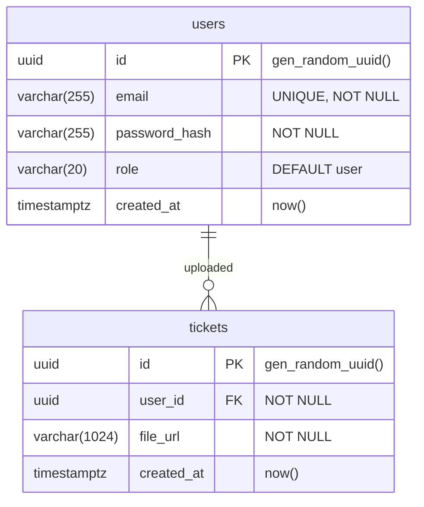

# TD database schema (Ticket Defender)

Database: `td`. Structure as reported from server (`information_schema` + `pg_indexes`).

## ER diagram (Mermaid)

## Tables and columns

**public.users**

| Column        | Type          | Constraints     | Default           |
|---------------|---------------|-----------------|-------------------|
| id            | uuid          | PRIMARY KEY     | gen_random_uuid() |
| email         | varchar(255)  | NOT NULL, UNIQUE| —                 |
| password_hash  | varchar(255)  | NOT NULL        | —                 |
| role          | varchar(20)   | NOT NULL        | 'user'            |
| created_at    | timestamptz   | NOT NULL        | now()             |

**public.tickets**

| Column     | Type           | Constraints              | Default           |
|------------|----------------|--------------------------|-------------------|
| id         | uuid           | PRIMARY KEY              | gen_random_uuid() |
| user_id    | uuid           | NOT NULL, FK → users(id)  | —                 |
| file_url   | varchar(1024)  | NOT NULL                 | —                 |
| created_at | timestamptz    | NOT NULL                 | now()             |

## Relationships

- **users** 1 —→ N **tickets**: `tickets.user_id` → `users.id` (ON DELETE CASCADE).

## Indexes (from server)

| Table   | Index                  | Definition            |
|---------|------------------------|------------------------|
| users   | users_pkey             | UNIQUE btree (id)     |
| users   | users_email_key        | UNIQUE btree (email)   |
| tickets | tickets_pkey           | UNIQUE btree (id)     |
| tickets | tickets_user_id_idx    | btree (user_id)       |
| tickets | tickets_created_at_idx | btree (created_at DESC) |
