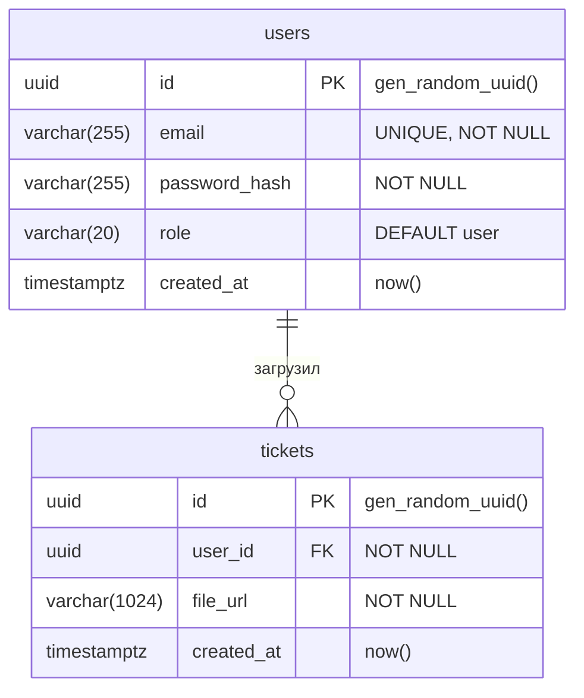

# Схема БД TD (Ticket Defender)

База данных: `td`. Спецификация: [Поля MVP Ticket Defender](https://docs.google.com/spreadsheets/d/1ufNkVvwihvz6xErw5D2cXae_-GSuseT31rz5sQJpiOs/edit?gid=1546643986).

*Структура приведена по состоянию на сервере (запрос `information_schema` + `pg_indexes`).*

## ER-диаграмма (Mermaid)

## Таблицы и колонки

**public.users**

| Колонка        | Тип           | Ограничения              | По умолчанию        |
|----------------|---------------|--------------------------|---------------------|
| id             | uuid          | PRIMARY KEY              | gen_random_uuid()   |
| email          | varchar(255)  | NOT NULL, UNIQUE          | —                   |
| password_hash  | varchar(255)  | NOT NULL                 | —                   |
| role           | varchar(20)   | NOT NULL                 | 'user'              |
| created_at     | timestamptz   | NOT NULL                 | now()               |

**public.tickets**

| Колонка    | Тип           | Ограничения                    | По умолчанию        |
|------------|---------------|--------------------------------|---------------------|
| id         | uuid          | PRIMARY KEY                    | gen_random_uuid()   |
| user_id    | uuid          | NOT NULL, FK → users(id) CASCADE | —                 |
| file_url   | varchar(1024) | NOT NULL                       | —                   |
| created_at | timestamptz   | NOT NULL                       | now()               |

## Связи

| Таблица   | Описание |
|-----------|----------|
| **users** | Пользователи; `id` может соответствовать `auth.users(id)` при интеграции с Supabase. |
| **tickets** | Тикеты: один пользователь может иметь много тикетов. `user_id` → `users(id)` ON DELETE CASCADE. |

## Индексы (с сервера)

| Таблица  | Индекс                  | Определение |
|----------|-------------------------|-------------|
| users    | users_pkey             | UNIQUE btree (id) |
| users    | users_email_key         | UNIQUE btree (email) |
| tickets  | tickets_pkey            | UNIQUE btree (id) |
| tickets  | tickets_user_id_idx     | btree (user_id) |
| tickets  | tickets_created_at_idx  | btree (created_at DESC) |
